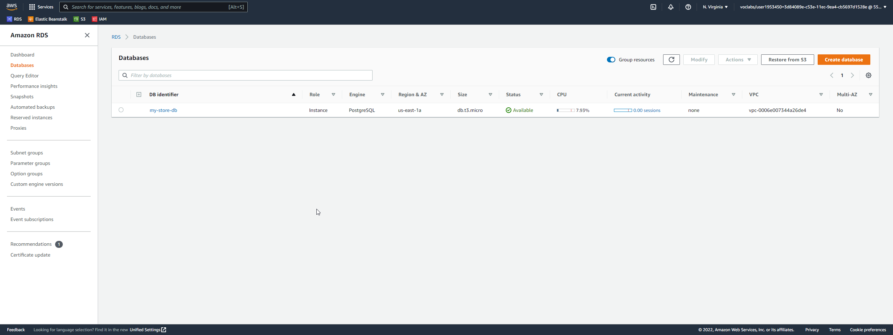
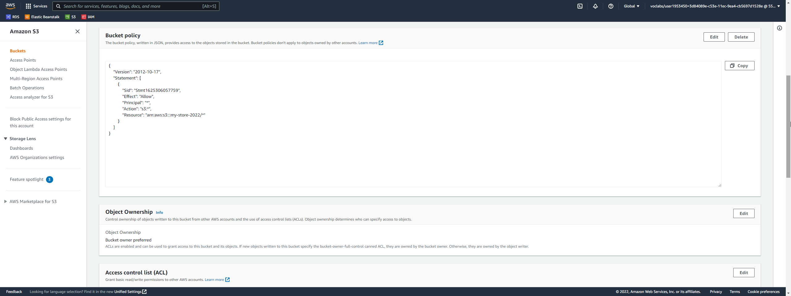
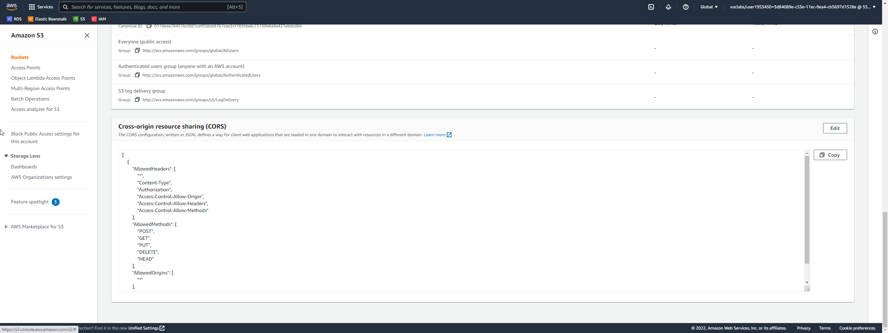
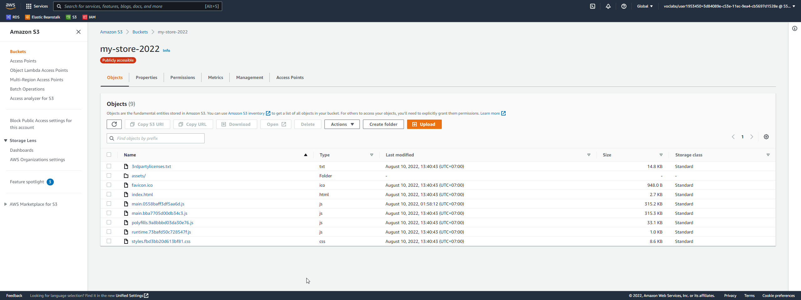
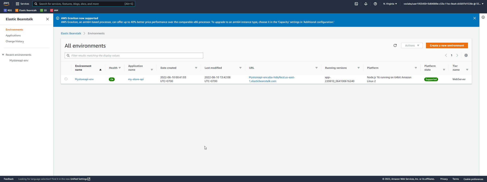
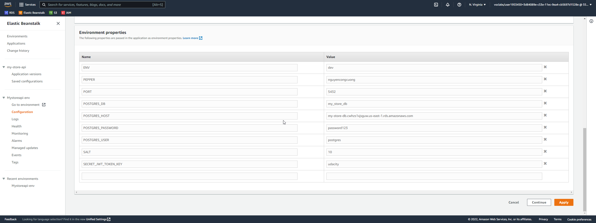
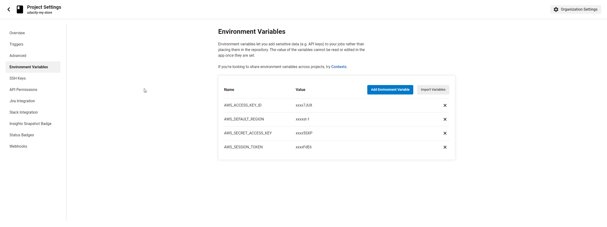
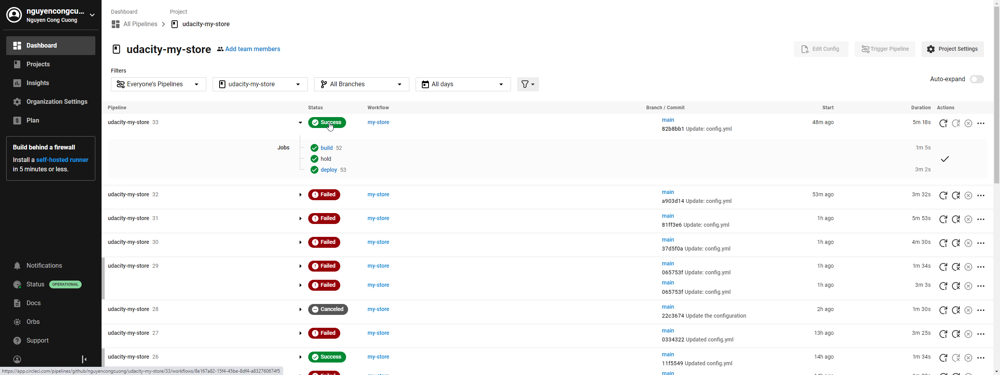

# PROJECT OVERVIEW

This is the 4th - the last project in the course Full Stack JavaScript Developer of the Udacity's Nanodegree Program.

This project focuses on setting up database, backend & frontend app as well as deploying these apps on AWS Cloud Services:
- AWS RDS (serving database)
- AWS Elastic Beanstalk (serving api application)
- AWS S3 Bucket (service static website)

# PROJECT ENDPOINTS:

- Database: [my-store-db.cwhzs1xjsguw.us-east-1.rds.amazonaws.com](http://my-store-db.cwhzs1xjsguw.us-east-1.rds.amazonaws.com)
- Front-end: [my-store-2022.s3-website-us-east-1.amazonaws.com](http://my-store-2022.s3-website-us-east-1.amazonaws.com)
- Back-end: [mystoreapi-env.eba-hsbyfecd.us-east-1.elasticbeanstalk.com](http://mystoreapi-env.eba-hsbyfecd.us-east-1.elasticbeanstalk.com)

# SCREENSHOTS

Below are the screenshots of the working applications:

## DATABASE

## FRONT-END

## BACK-END

## CIRCLECI

#GET_PASSES_THIS_REPO_UDACITY_PLEASE
