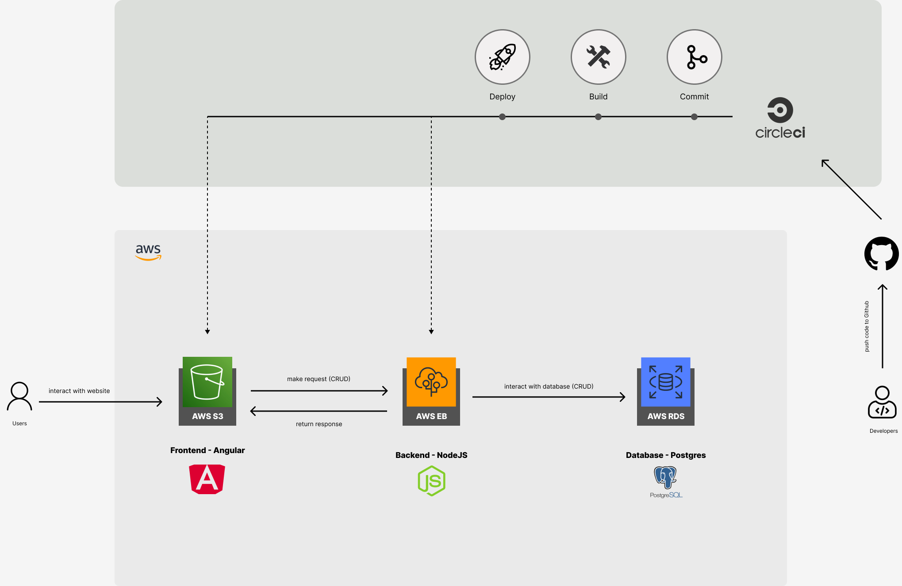

# INFRASTRUCTURE DESCRIPTION

This page gives a simple explanation for the project's infrastructure. 

Below is a diagram that shows the services used by the project as well as the relationship among these services.

## Application Overview

My Store Project is simple ecommerce application with a few basic features:
 
- Signup
- Login
- Product view
- Product cart
- Product checkout

It's a Full-stack app built as a project assignment for the Full Stack JavaScript Developer Nanodegree Program. Application's Stack:

- SQL
- NodeJS - Express
- Angular

It's served with 4 main services:

1. GiHub as repository hosting
2. CircleCI as CI/CD
3. Amazon RDS as Database server
4. AWS Elastic Beanstalk as Backend server
5. Amazon S3 Bucket as Frontend static site hosting

The application's dependencies can be found at: `app_dependencies.md`

## Diagram Workflow

### Flow 1: Developing

Developers will work with the project on their local machines. After finishing each application feature, they will commit and push the codes to GitHub

As the project's scope limitations, there's currently no guard for commits. Every commit can be pushed to *main* branch directly on GitHub.

### Flow 2: CI/CD

GitHub is configured properly with CircleCI so that CircleCI will listen each commit change. For each new commit pushed, an automation process for building and deploying will be triggered.

After this process, the built code will be deployed to AWS S3 & AWS EB.

For more details of this process, please take a look at `pipline_description.md`

### Flow 3: Post-Deployment

After the deployment, users are now able to access or see changes on the UI. When they interact on the website, the website (AWS S3) will make requests and receive the responses from the server (AWS EB). The server needs to interact with the database, such as creating - reading - updating - deleting items, so that it can return Frontend proper responses.
